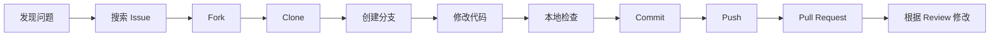

# 贡献流程

欢迎提交 Issue、改进文档或发起 Pull Request！本页面面向第一次参与开源项目的同学。即使你还不熟悉 Git，也可以按照下面的步骤完成一次规范贡献。

## 先理解一次贡献会经过什么

一个常见的代码贡献可以概括为：

- **Issue**：用来讨论 Bug、功能建议或文档问题。
- **Fork**：在自己的 GitHub 账号下复制一份仓库，获得推送权限。
- **Clone**：把远程仓库下载到自己的电脑。
- **分支**：一条独立的修改线路，不直接污染 main。
- **Commit**：保存一组有意义的修改，并写下这次修改的说明。
- **Push**：把本地分支上传到自己的 GitHub 仓库。
- **Pull Request（PR）**：请求维护者把你的分支合并到项目的 main。
- **Review**：维护者检查代码、测试和文档，并提出修改建议。

## 你可以贡献什么

- **文档**：修正错别字、补充使用说明、更新开发指南。
- **Bug 修复**：修复可以稳定复现的问题。
- **功能改进**：在已有功能基础上增加合理能力。
- **测试**：为已有逻辑补充单元测试或组件测试。
- **体验改进**：优化界面、可访问性、错误提示或跨平台行为。

如果只是发现问题，先提交 Issue 不需要先会写代码；如果不确定方案，也可以先在 Issue 中与维护者讨论。

## 一、提交 Issue 前先做什么

1. 在 GitHub Issue 中搜索关键词，确认没有重复问题。
2. 确认问题仍能在最新版本复现。
3. 记录使用的平台、应用版本和复现步骤。
4. 删除或打码学号、密码、Token、截图中的个人信息。

### Bug 报告至少要写清楚

- 你做了什么操作；
- 你原本期待什么结果；
- 实际出现了什么结果；
- 是否每次都能复现；
- 使用的系统、设备和应用版本。

标题可以写成：

~~~text
[Bug] 课表导出到 ICS 后日期错位
~~~

功能建议则应说明使用场景、希望解决的问题和可接受的交互方式。提交前可以参考仓库的 [Issue 模板](https://github.com/The-Brotherhood-of-SCU/Bugaoshan/tree/main/.github/ISSUE_TEMPLATE)。

## 二、准备本地环境

代码贡献前先阅读[环境与构建](./getting-started.md)，安装 [Flutter SDK](https://docs.flutter.dev/get-started/install)、[Git](https://git-scm.com/downloads) 和目标平台工具。Flutter SDK 已经包含 Dart，一般不需要单独安装 Dart。

主仓库的环境要求是 Flutter 3.44 或更高版本、Dart 3.10.4 或更高版本。进入项目后先检查：

~~~bash
flutter --version
dart --version
flutter doctor -v
~~~

然后安装依赖并生成文件：

~~~bash
flutter pub get
dart run build_runner build --delete-conflicting-outputs
flutter gen-l10n
~~~

如果你只修改文档站，不需要准备 Flutter：文档站是独立仓库 [Bugaoshan_docs_page](https://github.com/The-Brotherhood-of-SCU/Bugaoshan_docs_page)，进入其 docs/ 目录后按照[文档依赖安装说明](./documentation.md#文档站依赖安装)安装 Node.js 和 pnpm，再使用 pnpm install 和 pnpm dev。

## 三、Fork、Clone 和设置远程仓库

### 1. Fork

打开 [Bugaoshan 仓库](https://github.com/The-Brotherhood-of-SCU/Bugaoshan)，点击右上角 **Fork**，在自己的账号下创建副本。

### 2. Clone 自己的副本

初学者推荐 HTTPS：

~~~bash
git clone https://github.com/<你的用户名>/Bugaoshan.git
cd Bugaoshan
~~~

<你的用户名> 要替换为自己的 GitHub 用户名，尖括号不要保留。

### 3. 添加主仓库地址

把主仓库保存为 upstream，以后可以用它同步最新代码：

~~~bash
git remote add upstream https://github.com/The-Brotherhood-of-SCU/Bugaoshan.git
git remote -v
~~~

看到 origin 指向自己的 Fork、upstream 指向项目主仓库，就说明设置完成。

## 四、创建自己的分支

不要直接在 main 上开发。先同步主仓库，再创建描述清楚的分支：

~~~bash
git switch main
git fetch upstream
git merge upstream/main
git push origin main
git switch -c feature/course-export
~~~

分支名可以按下面的类型选择：

- feature/<功能>：新增功能
- fix/<问题>：修复 Bug
- docs/<内容>：修改文档
- refactor/<模块>：重构，不改变用户可观察功能

如果你的 Git 版本较旧，也可以使用等价命令：

~~~bash
git checkout main
git checkout -b feature/course-export
~~~

## 五、修改代码时的基本习惯

1. 每次只处理一个主题，避免把格式化、重命名和功能修改混在一起。
2. 修改前先阅读相关页面、Provider、Service 和测试，理解数据从哪里来、在哪里变化。
3. 不要把密码、Token、真实账号、私钥或本地路径写入代码和日志。
4. 本地化文案修改 lib/l10n/*.arb，不要直接编辑生成的 app_localizations*.dart。
5. 修改依赖、认证、数据存储等边界时，先阅读对应架构文档和 AGENTS.md。

如果你只改一个按钮或一段文案，也应先确认它的页面入口和多语言来源，而不是只改表面显示文字。

## 六、提交前检查

在项目根目录运行：

~~~bash
dart format .
flutter analyze
flutter test
~~~

如果修改了生成相关源文件，再运行：

~~~bash
dart run build_runner build --delete-conflicting-outputs
flutter gen-l10n
~~~

检查本次到底改了什么：

~~~bash
git status
git diff
git diff --check
~~~

git diff 是给自己看的最终检查单。确认没有把 .dart_tool/、build/、IDE 配置、密钥或与本次任务无关的文件带进来。

### 安装提交钩子

项目的 pre-commit hook 会对暂存的 Dart 文件执行 dart format：

~~~bash
# Linux / macOS
ln -sf .githooks/pre-commit .git/hooks/pre-commit

# Windows（Git Bash）
cp .githooks/pre-commit .git/hooks/pre-commit
~~~

钩子不是测试的替代品；它只能帮助保持格式统一，不能代替 flutter analyze 和 flutter test。

## 七、Commit 怎么写

项目使用约定式提交（[Conventional Commits](https://www.conventionalcommits.org/zh-hans/)）：

~~~text
<type>: <简短说明>
~~~

常用类型：

| type | 适用场景 |
| --- | --- |
| feat | 新功能 |
| fix | 修复 Bug |
| docs | 文档变更 |
| refactor | 重构，不改变功能 |
| test | 测试变更 |
| build | 依赖或构建系统变更 |
| ci | 持续集成配置变更 |
| chore | 其他工程维护 |

示例：

~~~bash
git add lib/pages/course docs/develop/guide
git commit -m "docs: 补充贡献流程说明"
~~~

提交应该做到“一次提交表达一个完整意图”。不要使用 update、修改一下 这类无法说明内容的标题；也不要为了凑数量把一项修改拆成很多没有意义的小提交。

## 八、Push 和创建 Pull Request

把当前分支推送到自己的 Fork：

~~~bash
git push -u origin feature/course-export
~~~

打开 GitHub 上自己的仓库，点击 **Compare & pull request**，确认：

- **base repository** 是 The-Brotherhood-of-SCU/Bugaoshan；
- **base branch** 是 main；
- **head repository** 是你的 Fork；
- **compare branch** 是本次功能分支，而不是 main。

PR 描述至少包括：

1. 改了什么；
2. 为什么要改；
3. 如何验证；
4. 是否关联 Issue（例如 Fixes #123）；
5. 是否有界面截图、录屏或需要特别注意的兼容性。

如果只是文档修改，也请说明检查过哪些链接、页面或本地构建步骤。

## 九、收到 Review 后怎么做

Review 是协作讨论，不代表代码一定有问题。逐条理解建议后，在本地修改并再次检查：

~~~bash
git add <修改过的文件>
git commit -m "fix: 根据 review 调整课程导出提示"
git push
~~~

Push 到同一个分支后，PR 会自动更新。若主仓库有新的提交，先同步 main 再处理冲突；不熟悉 rebase 时不要盲目执行，先保留工作区备份并询问维护者。

## 常见新手问题

| 问题 | 处理方式 |
| --- | --- |
| SSH 克隆提示 Permission denied | 改用 HTTPS，或先配置 GitHub SSH 密钥 |
| git push 被拒绝 | 确认推送的是自己的 origin，不是主仓库；检查分支名和登录凭据 |
| 不知道自己改了什么 | 运行 git status 和 git diff，逐个查看文件 |
| 合并冲突 | 打开冲突文件，保留正确内容，删除冲突标记后重新检查 |
| PR 中出现一堆无关文件 | 不要直接全部 git add .；用 git add 文件精确暂存，并检查 git diff --cached |
| 测试失败但不知道是否由自己引起 | 先记录完整错误，在主分支和自己的分支分别复现并在 PR 中说明 |
| 想撤销未提交的局部修改 | 先复制需要保留的内容，再使用编辑器的撤销或 Git 工具；不要直接执行不了解后果的清理命令 |

::: warning 保护隐私和凭据
不要在 Issue、Commit、PR、日志或截图中公开密码、Token、Cookie、私钥、学号和真实个人信息。发现凭据已经提交时，应立即告知维护者并更换凭据，仅删除文件并不能让历史中的秘密失效。
:::
::: tip 完整规范
Issue、Commit 和 PR 的详细格式见[贡献规范](./contribution-guide.md)。仓库级别的代码约定和安全边界以主仓库的 [AGENTS.md](https://github.com/The-Brotherhood-of-SCU/Bugaoshan/blob/main/AGENTS.md) 为准。
:::
