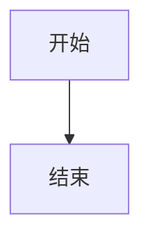

# 文档撰写指南

本指南面向向本文档站投稿的开发者，介绍文档的组织方式、frontmatter 约定与写作规范。

::: tip
本文档站基于 [VuePress 2](https://vuepress.vuejs.org/) 构建，使用 [vuepress-theme-plume](https://theme-plume.vuejs.press/) 主题。更完整的功能说明见[主题官方文档](https://theme-plume.vuejs.press/)。
:::

## 文档组织

文档站是独立仓库 `Bugaoshan_docs_page`，内容放在仓库根目录的 `docs/` 目录下，顶层按读者划分：

- `manual/` — 用户文档：面向 App 使用者，介绍功能与下载。
- `changelog/` — 更新日志：面向 App 使用者，记录版本更新内容。
- `develop/` — 开发文档：面向贡献者，介绍环境、架构与决策。

`develop/` 下进一步分三个子栏目：

| 子栏目 | 内容 | 更新时机 |
| --- | --- | --- |
| `guide/` | 开发指南：环境构建、项目结构、贡献流程、本指南 | 随开发指引变化 |
| `architecture/` | 架构设计：当前实现的权威说明 | 随实现变更同步更新 |
| `decisions/` | 架构决策：ADR 长期约束 | 接受新决策时追加 |

新增文档前，先判断它属于"用户文档""开发指南""当前实现"还是"设计决策"，避免多处维护同一事实。

## Frontmatter 与自动导航

导航栏和侧边栏由构建脚本自动扫描目录生成，**不需要手动维护导航配置**。脚本读取每个 Markdown 文件的 frontmatter 来决定排序、标题与图标。

常用字段：

| 字段 | 适用 | 含义 |
| --- | --- | --- |
| `order` | 文件 | 在侧边栏中的排序，数字越小越靠前，缺省排最后 |
| `dir.order` | 目录 | 目录在导航栏/侧边栏中的排序 |
| `title` | 文件/目录 | 显示的标题，缺省取一级标题，再缺省取文件名 |
| `icon` | 文件/目录 | 图标（Iconify 格式，如 `mdi:github`） |
| `index` | 目录 | `false` 时目录标题不可点击（不生成链接），默认 `true` |
| `collapsed` | 目录 | `false` 时默认展开，默认 `true`（折叠） |

示例：

```markdown
---
title: 认证架构
icon: mdi:shield-key-outline
order: 2
---
```

图标从 [Iconify](https://icon-sets.iconify.design/) 选取，复制其关键字即可。

## Markdown 写作

### 容器与提示

用容器强调内容：

```markdown
::: tip 提示
这是一个提示
:::

::: warning 注意
这是一个警告
:::

::: danger 危险
这是一个危险提示
:::

::: details 详情
点击展开的细节
:::
```

::: tip 提示
这是一个提示
:::

::: warning 注意
这是一个警告
:::

::: danger 危险
这是一个危险提示
:::

::: details 详情
点击展开的细节
:::

支持的类型：`tip`、`note`、`info`、`warning`、`danger`、`details`。嵌套容器时父级比子级多写一个冒号 `:`。

### 图标

文档正文中可使用 `<Icon />` 组件：

```markdown
<Icon name="mdi:github" size="1.5em" />
```

<Icon name="mdi:github" size="1.5em" />

### 图表

架构文档推荐用 mermaid 图表达依赖与流程，使用 `mermaid` 语言围栏即可渲染（已在站点配置中启用，并安装了 `mermaid` 依赖）：

````markdown

````


### 数学公式

支持 KaTeX 数学公式，行内用 `$...$`，独立行用 `$$...$$`。

### 代码块

指定语言即可获得高亮：

````markdown
```dart
void main() => runApp(const App());
```
````

```dart
void main() => runApp(const App());
```

## 链接规范

- 站内文档使用相对链接，如 `[架构决策](../decisions/)`。
- 指向源码文件的链接统一用 GitHub 绝对链接：`https://github.com/The-Brotherhood-of-SCU/Bugaoshan/blob/main/lib/...`。
- 不写本机绝对路径或易失效的代码行号。

## 维护规则

- 架构文档与代码冲突时以代码为准，并在同一变更中修正文档。
- ADR 一旦接受，只修正事实错误；方向改变时新增 ADR，并把旧 ADR 标记为已取代。
- 临时实施清单、已完成的迁移步骤和可由 Git 直接还原的变更摘要不单独保留。
- 架构文档的修改必须遵守各文档末尾的"不变量"或"修改检查清单"。

## 文档站本地运行

**大多数时候你并不需要用到以下的内容，确保你知道你在干什么。**

文档站和 App 使用不同的工具链。文档站使用 Node.js、pnpm、VuePress 和 Vite。修改 Markdown 之前，先进入独立文档站仓库 `Bugaoshan_docs_page`，不要在主 App 仓库的根目录执行下面的命令。

### 环境要求

版本要求记录在 `docs/package.json` 的 `devEngines` 中：

- [Node.js](https://nodejs.org/en/download) `24.19.0` 或更高版本；
- [pnpm](https://pnpm.io/installation) `11.22.0` 或更高版本。

安装 Node.js 后，确认终端能找到它：

```bash
node --version
npm --version
```

### 安装 pnpm

如果当前 Node.js 自带 Corepack，可以使用项目指定版本：

```bash
corepack enable
corepack prepare pnpm@11.22.0 --activate
```

如果系统提示没有 `corepack`，可以用 npm 安装同一版本：

```bash
npm install --global pnpm@11.22.0
```

确认版本：

```bash
pnpm --version
```

版本不一致时，优先以 `docs/package.json` 和 `pnpm-lock.yaml` 中的项目配置为准，不要随意升级 VuePress 或主题版本。

### 安装项目依赖

在文档站仓库根目录执行：

```bash
cd docs
pnpm install
```

这一步会读取 `package.json` 和 `pnpm-lock.yaml`，安装 VuePress、主题、Vite、Mermaid 等构建依赖，并生成本地 `node_modules`。依赖缓存目录只用于本机，不应提交到 Git。

日常开发可使用锁文件进行严格安装：

```bash
pnpm install --frozen-lockfile
```

如果只想安装依赖而不运行安装脚本，可以使用：

```bash
pnpm install --frozen-lockfile --ignore-scripts
```

### 本地预览和构建

```bash
pnpm dev     # 本地开发，默认 http://localhost:8080
pnpm build   # 构建到 .vuepress/dist
```

运行 `pnpm dev` 后打开终端显示的地址；修改 Markdown 后页面通常会自动刷新。停止开发服务器可在终端按 `Ctrl+C`。

如果只修改了文档内容，可以先检查站内链接，再运行构建。构建失败时请保留完整错误信息，并记录 Node.js、pnpm 和操作系统版本。
